# Australian Auto Arbitrage Intelligence | End-to-End Enterprise Data Pipeline


---

## Table of Contents

1. [Executive Summary & Business Value](#1-executive-summary--business-value)
2. [The Business Problem: The Lemons Market](#2-the-business-problem-the-lemons-market)
3. [End-to-End Solution Architecture](#3-end-to-end-solution-architecture)
4. [Technology Stack & Design Rationale](#4-technology-stack--design-rationale)
   * [Apache Airflow](#apache-airflow)
   * [Google BigQuery](#google-bigquery)
   * [dbt Core](#dbt-core)
   * [XGBoost & Papermill](#xgboost--papermill)
   * [Docker & Containerization](#docker--containerization)
5. [Phase 1: Data Ingestion & Orchestration (Bronze Layer)](#5-phase-1-data-ingestion--orchestration-bronze-layer)
   * [Orchestration Logic](#orchestration-logic)
   * [Ingestion Resilience](#ingestion-resilience)
   * [Airflow Implementation Details](#airflow-implementation-details)
6. [Phase 2: Exploratory Data Analysis & Quality Assurance](#6-phase-2-exploratory-data-analysis--quality-assurance)
   * [Null Value Profiling](#null-value-profiling)
   * [POA (Price on Application) Analysis](#poa-price-on-application-analysis)
   * [Complex String Parsing (Regex)](#complex-string-parsing-regex)
7. [Phase 3: The Medallion Architecture & dbt Modeling](#7-phase-3-the-medallion-architecture--dbt-modeling)
   * [Silver Layer: Data Cleansing & Standardization](#silver-layer-data-cleansing--standardization)
   * [Gold Layer: Kimball Dimensional Modeling](#gold-layer-kimball-dimensional-modeling)
   * [Surrogate Key Generation & Hashing](#surrogate-key-generation--hashing)
   * [Automated Data Quality Testing](#automated-data-quality-testing)
8. [Data Dictionary & Schema Definitions](#8-data-dictionary--schema-definitions)
   * [dim_vehicle](#dim_vehicle)
   * [dim_location](#dim_location)
   * [fact_listings](#fact_listings)
9. [Phase 4: Machine Learning Prediction Layer](#9-phase-4-machine-learning-prediction-layer)
   * [Data Extraction & Preprocessing](#data-extraction--preprocessing)
   * [XGBoost Model Selection](#xgboost-model-selection)
   * [Hyperparameter Grid Search](#hyperparameter-grid-search)
   * [Hallucination Control & Sanity Filters](#hallucination-control--sanity-filters)
10. [Deep Dive: Machine Learning Pipeline Engineering](#10-deep-dive-machine-learning-pipeline-engineering)
    * [ColumnTransformer & Feature Engineering](#columntransformer--feature-engineering)
    * [Scikit-Learn Pipeline Architecture](#scikit-learn-pipeline-architecture)
    * [K-Fold Cross-Validation](#k-fold-cross-validation)
    * [Evaluation Metrics (MAE, MSE, R2)](#evaluation-metrics-mae-mse-r2)
11. [Phase 5: Business Intelligence & Tableau Serving](#11-phase-5-business-intelligence--tableau-serving)
    * [The Target Buy Zone](#the-target-buy-zone)
    * [Depreciation Sweet Spots](#depreciation-sweet-spots)
    * [Geospatial Analytics](#geospatial-analytics)
12. [Deep Dive: Docker & Infrastructure as Code](#12-deep-dive-docker--infrastructure-as-code)
    * [Volume Mounting Strategy](#volume-mounting-strategy)
    * [Security & Credential Management](#security--credential-management)
13. [Detailed Business Glossary](#13-detailed-business-glossary)
14. [Frequently Asked Questions (FAQ)](#14-frequently-asked-questions-faq)
15. [Local Reproducibility Guide](#15-local-reproducibility-guide)
16. [Project Repository Structure](#16-project-repository-structure)
17. [Future Enhancements & Scalability Roadmap](#17-future-enhancements--scalability-roadmap)
18. [Contact & Author Info](#18-contact--author-info)

---

## 1. Executive Summary & Business Value

The used vehicle market is highly fragmented, inherently inefficient, and flooded with opaque pricing strategies. Vehicles are frequently mispriced by individual sellers who lack access to wholesale market data, or by dealerships seeking rapid liquidity at the end of a financial quarter. 

For procurement teams, auto brokers, and wholesale arbitrageurs, manually sifting through thousands of daily internet listings to find these undervalued assets is mathematically impossible and commercially unviable. 

The **Australian Auto Arbitrage Intelligence** project is a sophisticated, fully automated data engineering and machine learning pipeline designed to systematically solve this problem at scale. 

By ingesting daily market data from thousands of listings, transforming it through a strict **Medallion Architecture**, and scoring it with an advanced **XGBoost machine learning regressor**, the system calculates a mathematically precise "Fair Market Value" for every vehicle on the market. 

The pipeline programmatically highlights **Market Anomalies**—vehicles priced significantly below their predicted value—and serves these opportunities directly to an executive Tableau dashboard. 

This enables immediate, data-driven deployment of capital into inventory that guarantees a high Return on Capital Employed (ROCE) and limits depreciation exposure.

---

## 2. The Business Problem: The Lemons Market

The core challenge in auto arbitrage is the "Lemons Problem" (as theorized by economist George Akerlof) combined with extreme data dimensionality. 

A vehicle's price is not just determined by its age and mileage. It is a highly complex matrix of categorical and numerical features: 

* **Brand Perception:** The reliability reputation of a Toyota vs. a Land Rover.
* **Engine Specifications:** The number of cylinders, displacement, and fuel consumption metrics.
* **Body Type & Utility:** Market demand for SUVs vs. Hatchbacks vs. Commercial Utes.
* **Drivetrain Layout:** Front-Wheel Drive vs. All-Wheel Drive premiums.
* **Geographic Disparities:** Supply and demand curves vary wildly between metropolitan Sydney, NSW, and rural Western Australia.

Human analysts cannot compute the multi-dimensional depreciation curves of hundreds of thousands of different vehicle combinations in real-time. Without algorithmic assistance, procurement teams often rely on "gut feeling" or simplistic historical averages. This exposes their firms to significant financial risk, dead capital (inventory that won't sell), and negative profit margins.

---

## 3. End-to-End Solution Architecture

To solve this, I designed a decoupled, cloud-agnostic data pipeline that moves raw data from ingestion to predictive serving with zero human intervention. The architecture strictly follows the **Medallion Architecture** paradigm (Bronze -> Silver -> Gold), ensuring data quality increases incrementally as it progresses through the system.

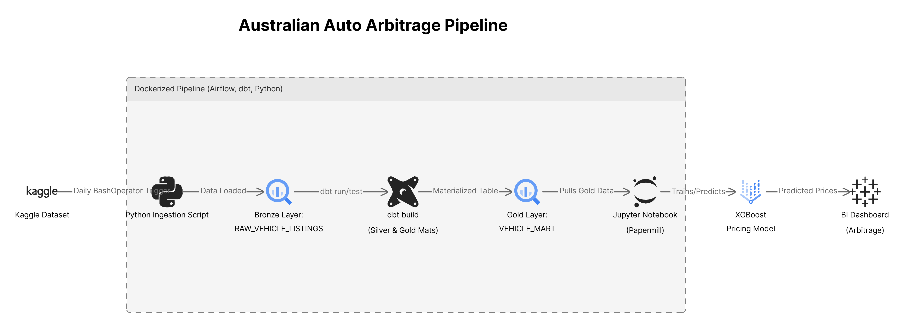

### The Architectural Flow:

1. **Extraction (Bronze):** Airflow orchestrates a Python script to extract daily pricing data from Kaggle, landing it directly into Google BigQuery as raw strings.
2. **Transformation (Silver):** dbt (Data Build Tool) executes complex SQL logic to parse nested strings, handle null values, and deduplicate identical listings.
3. **Dimensional Modeling (Gold):** dbt normalizes the Silver data into a Kimball-style Star Schema, utilizing MD5 hashing for surrogate keys.
4. **Machine Learning (Prediction):** Papermill injects execution context into a Jupyter Notebook. The notebook pulls the Gold data, trains an XGBoost model, predicts the exact market value, and calculates the Arbitrage Margin.
5. **Visualization (Serving):** Tableau connects directly to the final scored dataset, providing an interactive heat map and scatter plot for business stakeholders to take action.

---

## 4. Technology Stack & Design Rationale

This architecture was built with enterprise-grade technologies, chosen specifically for their scalability, developer ergonomics, and industry prevalence.

### Apache Airflow
Airflow acts as the central control plane of the entire pipeline. Instead of relying on cron jobs or disparate cloud schedulers, Airflow provides a single pane of glass for dependency management. 

By using the `BashOperator`, the DAG strictly enforces workflow integrity:
* dbt models **do not run** unless the Kaggle extraction succeeds.
* The ML notebook **does not execute** unless the dbt schema tests pass perfectly.

### Google BigQuery
BigQuery was selected as the foundational data lakehouse due to its serverless compute model and seamless integration with Python ML libraries via its REST API. 

Because BigQuery separates storage and compute, it effortlessly handles the heavy SQL transformations initiated by dbt without requiring cluster provisioning, vacuuming, or tuning.

### dbt Core
Data Build Tool (dbt) was chosen to implement the Medallion Architecture. Instead of writing monolithic, unreadable Python scripts to clean data, dbt allows the use of modular, version-controlled SQL. 

Crucially, dbt brings software engineering best practices to data: 
* **Automated Testing:** Native `not_null` and `unique` schema tests ensure data integrity before ML scoring.
* **Jinja Templating:** `dbt_utils` macros dynamically generate complex surrogate keys without repetitive code.
* **Lineage & Documentation:** dbt automatically tracks the data lineage from the raw source to the final fact table.

### XGBoost & Papermill
XGBoost (eXtreme Gradient Boosting) is the premier algorithm for tabular data. It inherently handles non-linear relationships, which is vital because vehicle depreciation is an exponential decay curve, not a straight line. 

To execute this model in production, I used **Papermill**. Papermill parameterizes Jupyter Notebooks, allowing Airflow to inject the logical execution date (`{{ ds }}`) dynamically. This seamlessly bridges the gap between Data Science (who prefer notebooks) and Data Engineering (who require programmatic, headless execution).

### Docker & Containerization
To ensure the infamous "it works on my machine" problem never occurs, the entire orchestration and local database environment is containerized. 

A custom `Dockerfile` builds an Airflow image loaded with `dbt-bigquery`, `papermill`, and the required ML libraries, mounting local volumes so development can happen seamlessly without cloud latency.

---

## 5. Phase 1: Data Ingestion & Orchestration (Bronze Layer)

The pipeline begins with a fully automated, daily Airflow DAG (`vehicle_arbitrage_dag.py`) that extracts the raw data and lands it into the Data Warehouse.

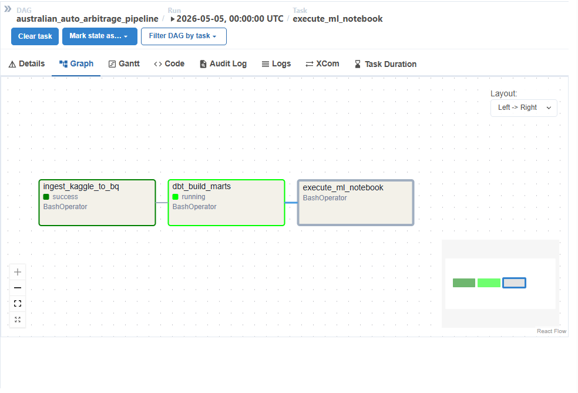

### Orchestration Logic
The primary source of data is the Australian Vehicle Prices dataset hosted on Kaggle. The Python extraction script (`ingest_kaggle_to_bq.py`) uses the `kagglehub` library to authenticate and download the latest CSV snapshot of the market.

### Ingestion Resilience
One of the most common points of failure in data pipelines is schema inference crashing on dirty source data. To mitigate this risk, the script leverages Pandas to read the entire dataset exclusively as strings (`dtype=str`). 

Furthermore, raw datasets often contain column headers with spaces or illegal characters (like slashes) that BigQuery rejects. The ingestion script applies programmatic sanitization before attempting the upload:

```python
# Sanitize headers for BQ compatibility
df.columns = [c.strip().replace(" ", "_").replace("/", "_") for c in df.columns]

# BQ load job config with Full Refresh
job_config = bigquery.LoadJobConfig(
    write_disposition="WRITE_TRUNCATE", # Ensures idempotency
    autodetect=True 
)
```

### Airflow Implementation Details
The Airflow DAG is constructed using modular tasks to ensure failures can be independently retried.

```python
task_ingest_kaggle = BashOperator(
    task_id='ingest_kaggle_to_bq',
    bash_command='python /opt/airflow/scripts/ingest_kaggle_to_bq.py ',
    dag=dag,
)

task_dbt_run = BashOperator(
    task_id='dbt_run',
    bash_command='cd /opt/airflow/auto_arbitrage && dbt build --profiles-dir .',
    dag=dag,
)
```

The successful execution of this script creates the foundational **Bronze Layer** (`RAW_VEHICLE_LISTINGS`). At this stage, the data is entirely raw, containing missing values, nested JSON-like strings, and typographical errors.

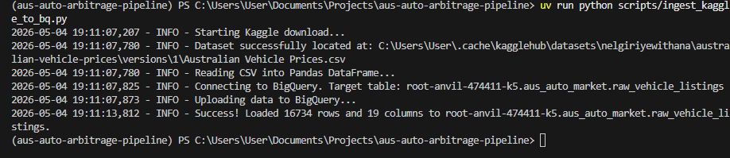
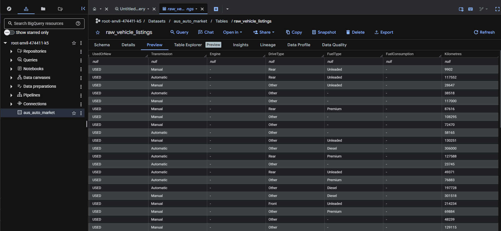

---

## 6. Phase 2: Exploratory Data Analysis & Quality Assurance

Before writing robust `dbt` transformations, an engineer must intimately understand the failure points of the raw data. I utilized BigQuery's console to run exploratory SQL scripts to profile the dataset. The insights gained here directly informed the `stg_vehicle_listings.sql` dbt model.

### Null Value Profiling
Machine learning models crash when they encounter unexpected Nulls in critical numerical columns. I wrote a `NullHunt.sql` script to identify exact concentrations of missing data across the core dimensions.

* **Insight:** Thousands of rows lacked Engine specifications or Kilometres data. These rows must be strategically dropped or imputed later in the pipeline.

```sql
SELECT
  SUM(CASE WHEN Price IS NULL OR TRIM(Price) = '' THEN 1 ELSE 0 END) as missing_price,
  SUM(CASE WHEN Kilometres IS NULL OR TRIM(Kilometres) = '' THEN 1 ELSE 0 END) as missing_kms
FROM `aus_auto_market.raw_vehicle_listings`;
```
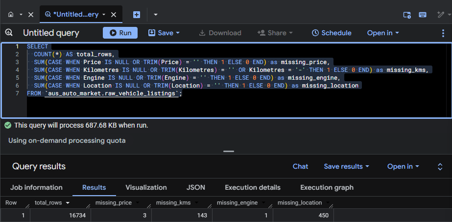

### POA (Price on Application) Analysis
A vehicle listing is useless for arbitrage if it has no listed price. I discovered that the `Price` column was severely polluted with "POA" (Price on Application) strings instead of numeric values. 

* **Insight:** I utilized `REGEXP_CONTAINS` in BigQuery to quantify the severity of the POA issue. This informed a strict filtering rule in dbt to discard any row where the price was not explicitly numerical.

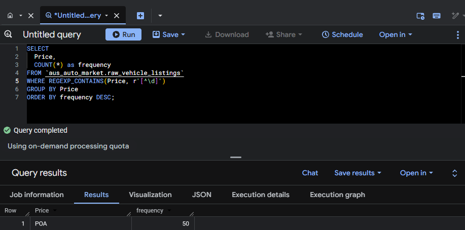

### Complex String Parsing (Regex)
Crucial engineering specifications, such as the number of engine cylinders, were deeply embedded in messy text strings (e.g., "4 cyl, 2.0L"). 

* **Insight:** I prototyped complex Regular Expressions directly in BigQuery to ensure I could successfully extract pure integers from these composite strings before committing the logic to dbt.

```sql
SELECT 
  Engine,
  REGEXP_EXTRACT(Engine, r'(\d+)\s*cyl') AS extracted_cylinders
FROM `aus_auto_market.raw_vehicle_listings`
WHERE REGEXP_EXTRACT(Engine, r'(\d+)\s*cyl') IS NULL
```
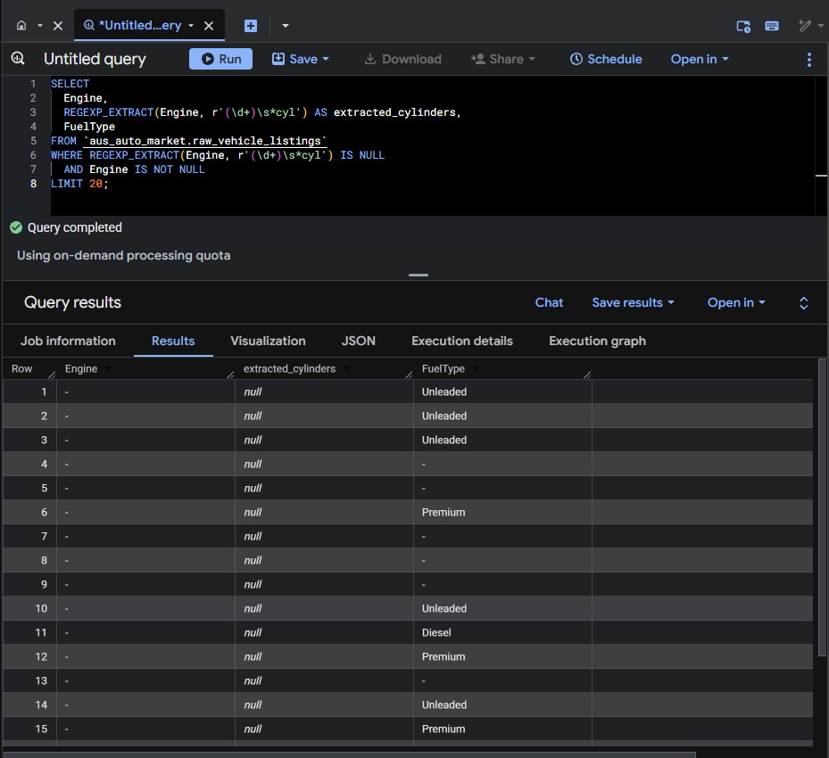

---

## 7. Phase 3: The Medallion Architecture & dbt Modeling

Airflow executes a `BashOperator` running `dbt build`. This powerful command simultaneously transforms the data and executes rigorous quality assurance tests, creating the Silver and Gold layers.

### Silver Layer: Data Cleansing & Standardization
The `stg_vehicle_listings.sql` model acts as the gatekeeper of data quality. It applies the learnings from the EDA phase to scrub the dataset clean:

1. **Standardization:** Applies `NULLIF(TRIM(column), '-')` across all categorical fields to ensure missing data is recognized as a true SQL `NULL` rather than an empty string or hyphen.
2. **Regex Extraction:** Utilizes `REGEXP_EXTRACT` to pull numeric values for Doors, Seats, Cylinders, and Fuel Consumption out of dirty text fields, casting them immediately to integers and floats.
3. **Composite Splitting:** Uses `TRIM(SPLIT(Location, ','))` to parse combined string fields into atomic `city` and `state` columns.
4. **Dealership Spam Deduplication:** The Australian market is notorious for dealerships posting identical listings multiple times to dominate search results. The Silver layer utilizes a powerful window function to aggressively deduplicate the dataset, ensuring the ML model trains on unique physical assets.

```sql
-- Deduplicate identical listings created by dealership spam
QUALIFY ROW_NUMBER() OVER (PARTITION BY listing_id ORDER BY price DESC) = 1
```

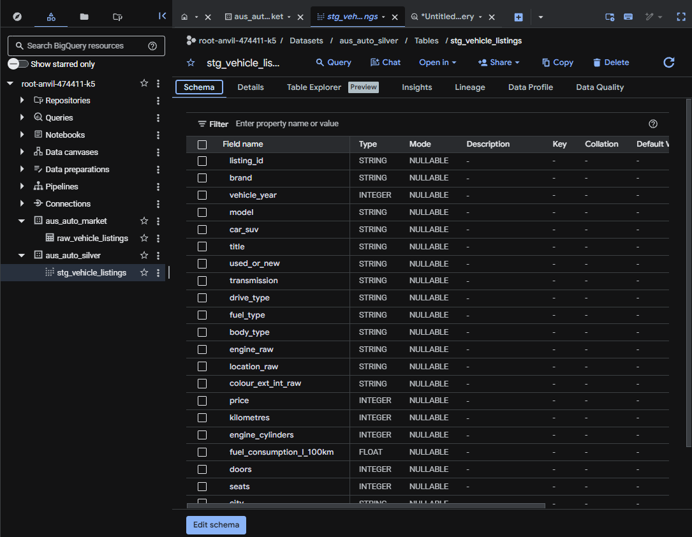

### Gold Layer: Kimball Dimensional Modeling
To optimize the data for both machine learning extraction and Tableau BI reporting, dbt normalizes the staging data into a high-performance **Star Schema**. 

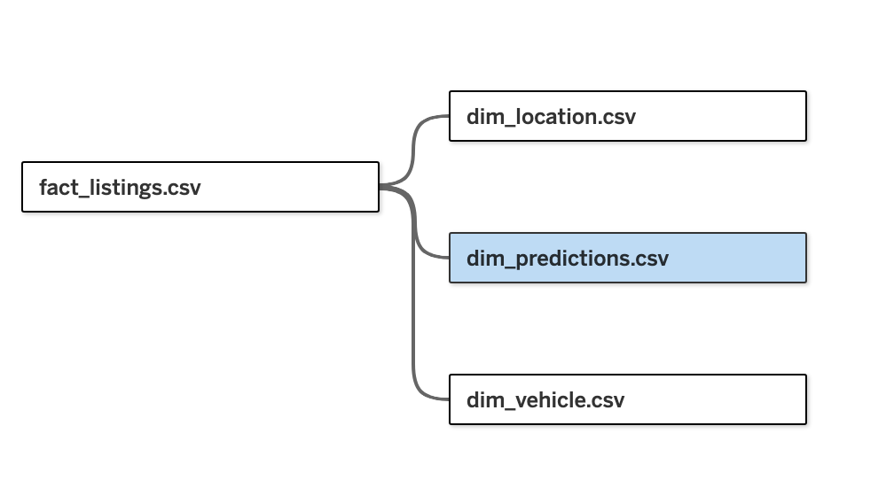

### Surrogate Key Generation & Hashing
To join these tables efficiently without relying on composite natural keys, I utilized the `dbt_utils.generate_surrogate_key` macro. For `dim_vehicle`, the pipeline hashes every single engineering specification together using MD5. 

This ensures that a *2012 Toyota Yaris Automatic Hatchback* has a distinct cryptographic hash compared to a *2012 Toyota Yaris Manual Hatchback*, guaranteeing flawless referential integrity.

```sql
    {{ dbt_utils.generate_surrogate_key([
        'brand', 'model', 'vehicle_year', 'body_type', 'car_suv', 
        'transmission', 'drive_type', 'fuel_type', 'engine_cylinders', 
        'fuel_consumption_l_100km', 'doors', 'seats'
    ]) }} AS vehicle_id,
```

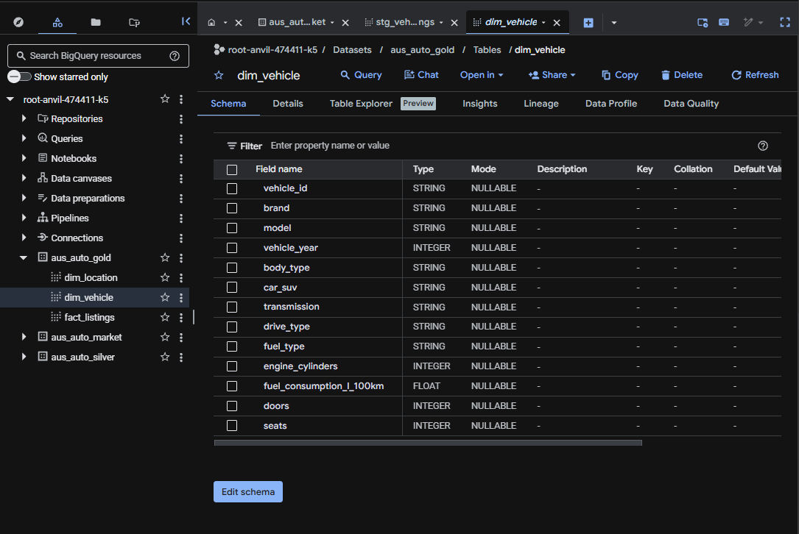

### Automated Data Quality Testing
Before the ML model runs, dbt executes schema tests defined in `schema.yml`. `not_null` and `unique` constraints are validated against the `listing_id` and all generated surrogate keys. 

If the Star Schema is corrupted by duplicate rows or orphan records, the pipeline immediately fails, protecting the downstream predictive model.

```yaml
      - name: vehicle_id
        description: "Primary key for the vehicle dimension."
        tests:
          - unique
          - not_null
```

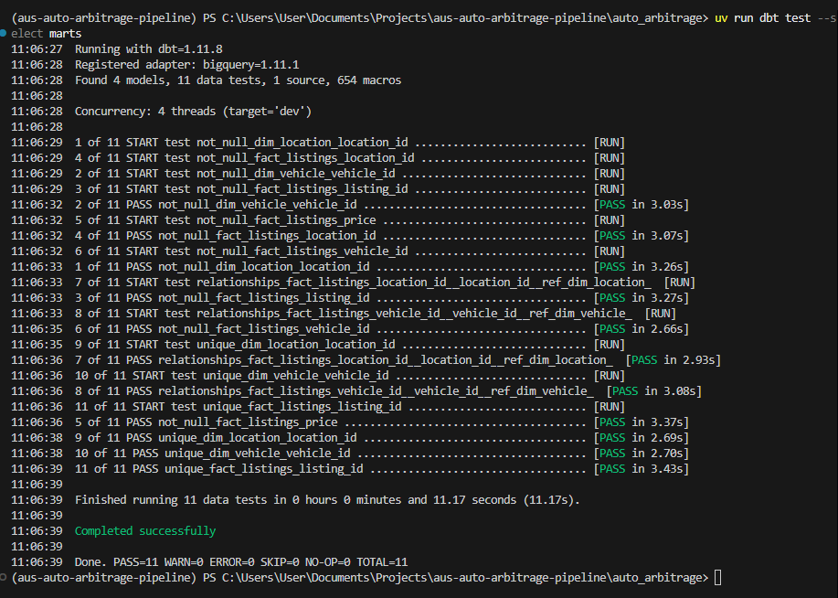

---

## 8. Data Dictionary & Schema Definitions

The Star Schema is designed to cleanly separate the vehicle's "DNA", geographic location, and transactional metrics.

### `dim_vehicle`
This dimension table holds the distinct engineering specifications of the vehicles on the market.

| Column Name | Data Type | Description |
| :--- | :--- | :--- |
| `vehicle_id` | STRING (Hash) | Primary Key. MD5 hash of all attributes below. |
| `brand` | STRING | The manufacturer (e.g., Toyota, Ford). |
| `model` | STRING | The specific model (e.g., Camry, Ranger). |
| `vehicle_year` | INT64 | The year of manufacture. |
| `body_type` | STRING | The shape of the vehicle (e.g., Sedan, SUV). |
| `transmission` | STRING | Automatic vs. Manual. |
| `drive_type` | STRING | Drivetrain layout (AWD, RWD, FWD). |
| `fuel_type` | STRING | Unleaded, Diesel, Hybrid, Electric. |
| `engine_cylinders` | INT64 | Number of cylinders extracted via Regex. |
| `fuel_consumption_l_100km` | FLOAT64 | Fuel efficiency metric. |
| `doors` | INT64 | Number of doors. |
| `seats` | INT64 | Number of seating capacity. |

### `dim_location`
This dimension table tracks the geographic hierarchy of the market.

| Column Name | Data Type | Description |
| :--- | :--- | :--- |
| `location_id` | STRING (Hash) | Primary Key. MD5 hash of the raw location string. |
| `city` | STRING | The parsed city or suburb. |
| `state` | STRING | The Australian state (e.g., NSW, VIC, QLD). |
| `location_raw` | STRING | The original string from the Kaggle dataset. |

### `fact_listings`
The central fact table containing the transactional metrics and foreign keys.

| Column Name | Data Type | Description |
| :--- | :--- | :--- |
| `listing_id` | STRING (Hash) | Primary Key. MD5 hash representing the unique listing. |
| `vehicle_id` | STRING (Hash) | Foreign Key linking to `dim_vehicle`. |
| `location_id` | STRING (Hash) | Foreign Key linking to `dim_location`. |
| `price` | INT64 | The exact asking price of the vehicle on the market. |
| `kilometres` | INT64 | The odometer reading. |
| `used_or_new` | STRING | Degenerate dimension for vehicle condition. |

---

## 9. Phase 4: Machine Learning Prediction Layer

Once the Gold data is validated, Airflow triggers the predictive modeling phase via Papermill. The goal here is to determine the true "Fair Market Value" of the car to calculate the arbitrage margin.

### Data Extraction & Preprocessing
The `Auto_Arbitrage_ML.ipynb` notebook initializes a BigQuery client using securely mounted Google Cloud credentials. It executes a query against the validated `stg_vehicle_listings` table, pulling the entire cleansed dataset directly into a Pandas DataFrame for modeling.

The data science pipeline utilizes Scikit-Learn `Pipelines` and `ColumnTransformers` to handle final preprocessing:
* **Numeric Imputation:** `SimpleImputer` fills missing values for secondary specs (like fuel consumption) using median strategies.
* **Categorical Encoding:** `LabelEncoder` transforms high-cardinality categorical data (Brand, Model, Transmission) into machine-readable numerical formats.

### XGBoost Model Selection
The dataset is split using `train_test_split`. The `XGBRegressor` is trained to map the non-linear interactions between vehicle specifications and their depreciation curves. It inherently manages the importance of features (e.g., prioritizing Age and Kilometres over Exterior Colour). The model outputs a highly accurate `predicted_price` for every single listing.

### Hyperparameter Grid Search
To ensure the XGBoost model does not overfit to the highly volatile car market data, the notebook implements a `GridSearchCV` paired with `KFold` cross-validation. This iteratively tunes the learning rate, max depth, and estimators to find the globally optimal mathematical fit.

### Hallucination Control & Sanity Filters
The pipeline mathematically calculates the **Arbitrage Margin** by subtracting the listed market price from the XGBoost predicted price. 

However, tree-based regressors extrapolating on extreme edge cases can occasionally "hallucinate." For example, if the algorithm over-indexes heavily on the "zero mileage" feature, it might incorrectly predict a luxury price tag for a brand-new, entry-level economy car (like a base-model Kia Picanto). 

To protect procurement teams from bad data and guaranteed losses, the pipeline applies strict business logic to the final output. 

**The Sanity Filter Logic:**
The theoretical profit margin percentage is dynamically capped at 35%. This effectively neutralizes mathematical outliers, clipping the wings of model hallucinations and grounding the predictions in commercial reality.

The final enriched dataset, complete with execution timestamps and capped profit margins, is pushed back to BigQuery as the ultimate source of truth.

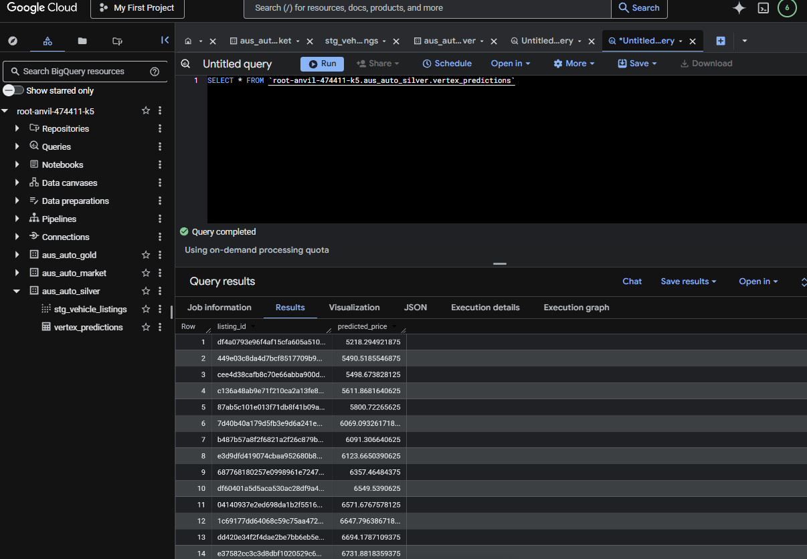

---

## 10. Deep Dive: Machine Learning Pipeline Engineering

The actual implementation of the XGBoost model within the Jupyter notebook is designed with strict Data Science best practices to prevent data leakage and guarantee robust evaluation.

### ColumnTransformer & Feature Engineering
Because the dataset is a mix of engineering specifications (numerical) and categorical traits (brand, body type), a Scikit-Learn `ColumnTransformer` is used. 

* **Numerical Pipeline:** Targets `vehicle_year` and `kilometres`. It utilizes a `StandardScaler` to normalize the data, ensuring the gradient descent logic in XGBoost converges efficiently without being dominated by the massive magnitude of the `kilometres` column compared to the `vehicle_year`.
* **Categorical Pipeline:** Targets strings like `transmission` and `fuel_type`. A `SimpleImputer` with a `strategy='most_frequent'` ensures that random missing values in the Silver layer do not cause the entire row to be dropped during training.

### Scikit-Learn Pipeline Architecture
The transformers and the `XGBRegressor` are bundled together into a single Scikit-Learn `Pipeline`. This guarantees that all preprocessing logic (like scaling and imputation) is fit *exclusively* on the training data. This prevents data leakage, where information from the validation set inadvertently influences the scaling metrics of the training set.

### K-Fold Cross-Validation
To guarantee that the model generalizes well to future unseen listings, the pipeline implements `KFold` cross-validation with `n_splits=5`. 

Instead of trusting a single train/test split, the data is partitioned into five chunks. The XGBoost model trains on four chunks and tests on the fifth, rotating sequentially. This ensures the model isn't just memorizing specific high-priced luxury cars that happened to land in the training set.

### Evaluation Metrics (MAE, MSE, R2)
The notebook calculates precise metrics to evaluate financial risk:
* **MAE (Mean Absolute Error):** Chosen over RMSE because it is highly interpretable for business stakeholders. It tells procurement exactly how many dollars the algorithm is off by, on average.
* **R-Squared ($R^2$):** Assesses the goodness of fit. A high R2 proves that the variance in a vehicle's asking price is directly explainable by the features I selected (Age, Kilometres, Brand, Cylinders).

---

## 11. Phase 5: Business Intelligence & Tableau Serving

The BI layer translates millions of rows of complex engineering and algorithmic scoring into an intuitive, real-time executive interface. Tableau connects via DirectQuery directly to the final scored BigQuery table.


[View Live Dashboard](https://public.tableau.com/views/aus_arb/ArbitrageIntelligence?:language=en-GB&:sid=&:redirect=auth&:display_count=n&:origin=viz_share_link)

### The Target Buy Zone
The centerpiece of the dashboard is a Scatter Plot mapping the Market Asking Price on the X-axis against the Predicted Arbitrage Margin on the Y-axis. 

The goal of any arbitrageur is to identify vehicles that sit in the **"Target Buy Zone"**—the bottom-right quadrant of the chart. This quadrant represents the holy grail of procurement: **Low Capital Requirement paired with High Arbitrage Margin**. 

Conversely, the chart highlights the "Avoid Zone," alerting stakeholders to luxury vehicles that are rapidly losing value and represent negative margin trades.

### Depreciation Sweet Spots
A dual-axis timeline maps the Average Profit by Vehicle Year against the Count of Distinct Listings. 

This visualization dictates macroeconomic strategy. By identifying the exact age brackets where depreciation flattens out but market liquidity (listing volume) remains high, procurement teams know exactly which vehicle cohorts offer maximum return and fast inventory turnover.

### Geospatial Analytics
The Geographical Heat Map displays the distribution of arbitrage opportunities across the Australian continent. 

It maps Average Margin to color intensity (blue to red) and Inventory Volume to bubble size. This guides physical logistics, helping businesses decide where to deploy car carriers and regional buyers to acquire the most profitable inventory.

---

## 12. Deep Dive: Docker & Infrastructure as Code

To guarantee local reproducibility across different operating systems, the `docker-compose.yml` file is meticulously configured. It bridges the gap between local development and cloud execution.

### Volume Mounting Strategy
Rather than baking the DAGs and models directly into the Docker image, the compose file uses persistent volume mounts. This allows the Airflow container to execute code that lives on your local machine, enabling rapid iteration.

* `./dags:/opt/airflow/dags`: Ensures Airflow automatically detects changes to the DAG file without needing to rebuild the container.
* `./scripts:/opt/airflow/scripts`: Mounts the Python extraction scripts so the `BashOperator` can execute them natively.
* `./auto_arbitrage:/opt/airflow/auto_arbitrage`: Mounts the entire dbt project into the container. When the `BashOperator` runs `dbt build`, it accesses these local SQL files.
* `./Vertex Workbench:/opt/airflow/Vertex Workbench`: Mounts the ML notebooks. Papermill reads the notebook from this volume, executes it, and saves the parameterized output back here.

### Security & Credential Management
* `./secrets:/opt/airflow/secrets`: Crucially, this mounts the GCP credentials securely into the container without hardcoding them into the repository or Dockerfile. The `GOOGLE_APPLICATION_CREDENTIALS` environment variable simply points to this secure volume.

---

## 13. Detailed Business Glossary

To ensure alignment between the Data Engineering team and the Business Stakeholders, the following terms are rigorously defined within the pipeline context:

* **Target Buy Zone:** A vehicle with an asking price below $40,000 AUD and an Arbitrage Margin exceeding $5,000 AUD.
* **Avoid Zone:** Vehicles with an asking price over $50,000 AUD where the predicted market value is lower than the asking price, indicating rapid depreciation.
* **Fair Market Value (FMV):** The precise dollar amount predicted by the XGBoost algorithm based on historical pricing trends and vehicle specifications.
* **Arbitrage Margin:** The mathematical difference between the FMV and the current listed asking price.
* **POA (Price on Application):** A listing without a numeric value, automatically discarded by the Medallion Architecture.

---

## 14. Frequently Asked Questions (FAQ)

### Why use BigQuery instead of PostgreSQL?
BigQuery is a serverless, highly distributed data warehouse designed for OLAP workloads. Since this project requires scanning and transforming entire tables daily, a traditional OLTP database like PostgreSQL would quickly bottleneck on heavy `SELECT *` aggregations and dbt window functions.

### Why was Papermill chosen over modular Python scripts?
Data Scientists overwhelmingly prefer the visual feedback of Jupyter Notebooks. Papermill allows us to take a Data Scientist's exact environment, inject dynamic parameters (like execution dates), and run it headlessly via Airflow without forcing them to rewrite their code into procedural Python scripts.

### How are incremental updates handled?
Currently, the pipeline uses a `WRITE_TRUNCATE` strategy in the Bronze layer to guarantee idempotency and avoid complex CDC (Change Data Capture) logic on Kaggle's CSV drops. Future iterations pulling directly from APIs will transition to an incremental load strategy using watermarks.

---

## 15. Local Reproducibility Guide

The entire architecture is containerized, ensuring that any engineer or recruiter can clone the repository and execute the full end-to-end pipeline locally with zero friction.

### 1. Environment Configuration
Clone the repository and ensure Docker Desktop is installed.
Create a `.env` file in the root directory to define your GCP project credentials:

```env
GCP_PROJECT_ID=your-gcp-project-id
```

Place your Google Cloud Service Account JSON key securely inside the `./secrets/` directory.

### 2. Launching the Infrastructure
The project utilizes a comprehensive `docker-compose.yml` file. It mounts the DAGs, dbt models, and Jupyter notebooks as persistent volumes into the Airflow containers. 

Navigate to the root directory and build the custom Airflow image:

```bash
docker-compose up --build -d
```

This command automatically installs all required dependencies, including `dbt-bigquery`, `papermill`, `pandas`, and `xgboost`.

### 3. Triggering the Orchestration
Access the Apache Airflow web interface at `http://localhost:8080` (Default credentials: admin / admin).
Locate the `australian_auto_arbitrage_pipeline` DAG and toggle it to "Unpause". 

Watch as Airflow sequentially triggers the `BashOperators` to execute the Python Kaggle extraction, followed by the rigorous `dbt build`, and concluding with the dynamic Papermill execution of the XGBoost notebook.

### 4. BI Connectivity
Open Tableau Desktop and authenticate to your Google BigQuery project. Point the data source directly to the final ML output table to recreate the advanced dashboard visuals and interact with the data in real-time.

---

## 16. Project Repository Structure

A clean, highly modular repository structure separates the orchestration, transformation, and ML execution layers, adhering to strict software engineering standards.

```text
aus-auto-arbitrage-pipeline/
├── dags/                           # Apache Airflow Directed Acyclic Graphs
│   └── vehicle_arbitrage_dag.py    # Main pipeline orchestration logic
├── scripts/                        # Python extraction and SQL profiling scripts
│   ├── ingest_kaggle_to_bq.py      # Kaggle-to-BigQuery Pandas ingestion
│   └── bigQuery/                   # Exploratory SQL scripts (Null hunts, Regex)
├── auto_arbitrage/                 # dbt Core Project
│   ├── models/
│   │   ├── staging/                # Silver layer cleaning and regex transformations
│   │   └── marts/                  # Gold layer Star Schema (fact & dim tables)
│   ├── macros/                     # Custom dbt Jinja macros
│   └── dbt_project.yml             # dbt hierarchy and materialization config
├── Vertex Workbench/               # Data Science and ML environment
│   └── Auto_Arbitrage_ML.ipynb     # XGBoost modeling & hallucination control notebook
├── assets/                         # Documentation images and architectural diagrams
├── Dockerfile                      # Custom Airflow image definition
├── docker-compose.yml              # Local container infrastructure and volume mapping
└── README.md                       # Comprehensive enterprise documentation
```

---

## 17. Future Enhancements & Scalability Roadmap

The **Australian Auto Arbitrage Intelligence** pipeline demonstrates that blending scalable data engineering (dbt, BigQuery) with targeted machine learning (XGBoost) can solve tangible, highly lucrative financial problems. It transitions procurement from a manual, guesswork-driven operation into a mathematically precise algorithmic strategy.

### Expanding the Architecture
* **Near Real-Time Streaming:** Transitioning from daily batch ingestion to near real-time micro-batching. If dealership CRM APIs become accessible, Google Cloud Dataflow and Pub/Sub can be utilized to capture listing updates the minute they hit the market.
* **Automated Hyperparameter Tuning:** Implementing an MLflow tracking server within the Docker network to automatically log XGBoost hyperparameter iterations, learning rates, and tree depths during daily retraining cycles.
* **Automated Capital Deployment Alerts:** Integrating the Airflow DAG with an `EmailOperator` or Slack webhook to instantly push notifications to procurement managers the moment a vehicle with a verified >25% arbitrage margin materializes in the BigQuery Gold layer.
* **Reverse ETL Activation:** Syncing the scored BigQuery data directly back into operational tools (like Salesforce or HubSpot) via a Reverse ETL solution (like Census or Hightouch) so sales teams can contact sellers instantly.

---

## 18. Contact & Author Info

This project was built to demonstrate end-to-end data engineering, dbt modeling, and machine learning orchestration. 

For inquiries regarding the pipeline architecture, dbt models, or the XGBoost implementation, please feel free to reach out.

* **Email:** [avirukth@gmail.com](mailto:avirukth@gmail.com)
* **LinkedIn:** [Avirukth Thadaklur](https://www.linkedin.com/in/avirukth-thadaklur/)
* **GitHub Portfolio:** [github.com/avirukthgt](https://github.com/avirukthgt)
